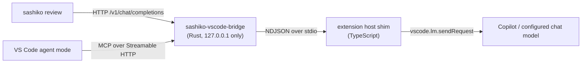

# Sashiko for VS Code

Run [Sashiko](https://github.com/sashiko-dev/sashiko) Linux kernel patch reviews from
VS Code using **the language model you already have configured in VS Code** — no
`LLM_API_KEY`, no provider account, no second CLI to authenticate.

## How it works

Sashiko already supports OpenAI-compatible endpoints. This extension provides one,
locally, backed by `vscode.lm`:



The same loopback listener also serves an **MCP server** at `/mcp`, so agent mode can
run reviews as tool calls. Tool invocations travel back over the existing stdio link
to the extension host, which owns the workspace configuration and the Problems panel —
no second server process is involved.

Everything except the ~10 lines that actually touch `vscode.lm` lives in the Rust
crate under [rust/](rust): the OpenAI wire format, SSE streaming, tool-call
translation, `Settings.toml` rendering, and report parsing.

The bridge binds `127.0.0.1` only and requires a per-session bearer token generated
from CSPRNG entropy. That token is handed to Sashiko as `OPENAI_API_KEY`, so the
loopback endpoint cannot be used by other processes that do not know it.

## Requirements

- A chat model available in VS Code (for example GitHub Copilot, signed in).
- VS Code 1.101 or newer, for the MCP server definition API.
- The `sashiko` binary on `PATH` (`cargo install sashiko`).
- A Linux kernel git checkout opened as the workspace folder.
- Rust 1.85+ and Node 20+ to build this extension.

## Build

```bash
npm install
npm run build:rust   # cargo build --release + stage bin/sashiko-vscode-bridge
npm run compile      # bundle dist/extension.js
```

Then press <kbd>F5</kbd> to launch the extension development host, or `npm run package`
to produce a `.vsix`.

## Continuous integration and releases

| Workflow | Trigger | What it does |
| --- | --- | --- |
| [ci.yml](.github/workflows/ci.yml) | push to `main`, pull requests | `cargo fmt`/`clippy`/`test`, `tsc --noEmit`, esbuild bundle, then builds every platform VSIX |
| [build-vsix.yml](.github/workflows/build-vsix.yml) | called by the other two | Cross-platform matrix build, uploads one VSIX artifact per target |
| [release.yml](.github/workflows/release.yml) | tag `v*` | Checks the tag matches `package.json`, rebuilds, publishes to the Marketplace, attaches the VSIXes to the GitHub release |

The bridge is a native binary, so the extension is published as **platform-specific
VSIXes** (`linux-x64`, `linux-arm64`, `darwin-x64`, `darwin-arm64`, `win32-x64`,
`win32-arm64`), each built on a matching runner. VS Code installs the right one
automatically.

To cut a release:

1. Bump `version` in `package.json` and commit.
2. `git tag v0.1.1 && git push --tags`.

One-time setup in the repository:

- Create a `marketplace` environment (Settings → Environments) and add a `VSCE_PAT`
  secret holding an Azure DevOps personal access token with **Marketplace → Manage**
  scope for the `fede2cr` publisher. Adding required reviewers to that environment
  gates every publish behind a manual approval.

## Usage

1. Open your kernel tree as the workspace folder.
2. Ask `@sashiko` to review something, or run **Sashiko: Select Language Model** to
   pin a model explicitly.
3. Run **Sashiko: Review HEAD Commit** (or **Review Commit Range...**).

Findings land in the Problems panel; the full transcript goes to the **Sashiko**
output channel. `Settings.toml` is generated per session into the extension's global
storage, so your repository is not touched. Use **Sashiko: Write Settings.toml for
Current Session** if you want a copy in the repository to run Sashiko by hand.

### From the chat view

Type `@sashiko` in the chat view:

| Prompt | Effect |
| --- | --- |
| `@sashiko` | Reviews the open patch file, or `HEAD` |
| `@sashiko HEAD~3..HEAD` | Reviews a revision range |
| `@sashiko /patch` | Reviews the attached or open `.patch`/`.mbox` files |
| `@sashiko /changes` | Reviews the uncommitted changes in the working tree |
| `@sashiko /commits v6.9..v6.10` | Reviews a revision range explicitly |

Drag patch files into the prompt to review a series in order. The review runs on **the
model selected in VS Code's own model picker**, and that choice is remembered: later
command-palette and agent-mode reviews reuse it until you pick a different one.

### Choosing the model

VS Code only reveals the picker's model on a chat request, so `@sashiko` is what
teaches the extension which model you want. Resolution order is:

1. `sashiko.model`, if you pinned one with **Sashiko: Select Language Model**.
2. The model `@sashiko` last ran with.
3. The first available chat model.

Sashiko replays whole patches plus surrounding kernel source through eleven stages, so
a small context window quietly truncates the evidence a finding rests on. Models that
cannot hold `sashiko.maxInputTokens` are flagged in the picker, sorted below the roomy
ones, and produce a warning before the review starts.

### From agent mode

The extension registers an MCP server, so agent mode can call Sashiko itself — ask it
to "review the patch I have open" and it will pick the right tool:

| Tool | Input |
| --- | --- |
| `sashiko_review_range` | A git revision or range |
| `sashiko_review_patch` | Paths to `.patch`/`.mbox` files |
| `sashiko_review_working_tree` | Nothing; uses tracked modifications |

Tools return a severity-ranked summary rather than the raw report, which would
otherwise swamp the agent's context. The full findings still go to the Problems panel.
MCP gives the agent no way to pass its own model down, so these reviews run on the
model resolved above.

Patch and working-tree reviews are staged into a **throwaway detached git worktree**
under the temp directory, reviewed there, and removed afterwards. Your checkout, index
and branches are never modified.

## Commands

| Command | Description |
| --- | --- |
| `Sashiko: Review HEAD Commit` | Review `HEAD` |
| `Sashiko: Review Commit Range...` | Review an arbitrary revision range |
| `Sashiko: Review Uncommitted Changes` | Review tracked working tree modifications |
| `Sashiko: Review Patch File in Active Editor` | Review the open `.patch`/`.mbox` file |
| `Sashiko: Cancel Running Review` | Interrupt the running review |
| `Sashiko: Select Language Model` | Choose which VS Code chat model to use |
| `Sashiko: Write Settings.toml for Current Session` | Emit a settings file wired to the live bridge |
| `Sashiko: Restart Language Model Bridge` | Respawn the bridge process |
| `Sashiko: Show Log` | Open the output channel |

## Settings

| Setting | Default | Description |
| --- | --- | --- |
| `sashiko.executable` | `sashiko` | Binary used to run reviews |
| `sashiko.reviewArgs` | `["review", "${range}", "--settings", "${settings}"]` | Arguments; supports `${range}`, `${settings}`, `${repository}` |
| `sashiko.repositoryPath` | *(workspace folder)* | Kernel repository to review |
| `sashiko.model` | *(follow the chat picker)* | Pin reviews to one VS Code chat model |
| `sashiko.provider` | `openai-compatible` | Provider name written to `Settings.toml` |
| `sashiko.worktreeDir` | `review_trees` | Sashiko worktree directory |
| `sashiko.concurrency` | `1` | Concurrent reviews; each one consumes chat quota |
| `sashiko.maxInputTokens` | `100000` | Clamped to the model's own limit |
| `sashiko.maxOutputTokens` | `16384` | Max output tokens per response |
| `sashiko.bridgePath` | *(bundled)* | Override the bridge binary |
| `sashiko.publishDiagnostics` | `true` | Publish findings to the Problems panel |

To drive `sashiko-cli` instead of `sashiko`, set `sashiko.executable` to `sashiko-cli`
and `sashiko.reviewArgs` to
`["--format", "json", "local", "${range}", "--force-local"]`.

## Caveats

- Reviews are token-hungry (11 stages per patch). They consume your VS Code chat
  quota, and rate limits surface as review failures — keep `sashiko.concurrency` at 1.
- The model picker only reaches Sashiko through `@sashiko`. Changing it and then
  running a review from the command palette or agent mode uses the last model
  `@sashiko` saw, not the one now showing in the picker.
- Working-tree reviews only cover **tracked** modifications; `git add` untracked files
  first if you want them reviewed.
- The VS Code chat API reports no token usage, so `usage` is estimated at four
  characters per token purely to keep Sashiko's budget caps meaningful.
- The chat API has no system role; system prompts are folded into user turns.
- Patch content and kernel context are sent to whichever model VS Code is configured
  with. Review your organisation's policy before pointing this at private trees.

## License

Apache-2.0.
